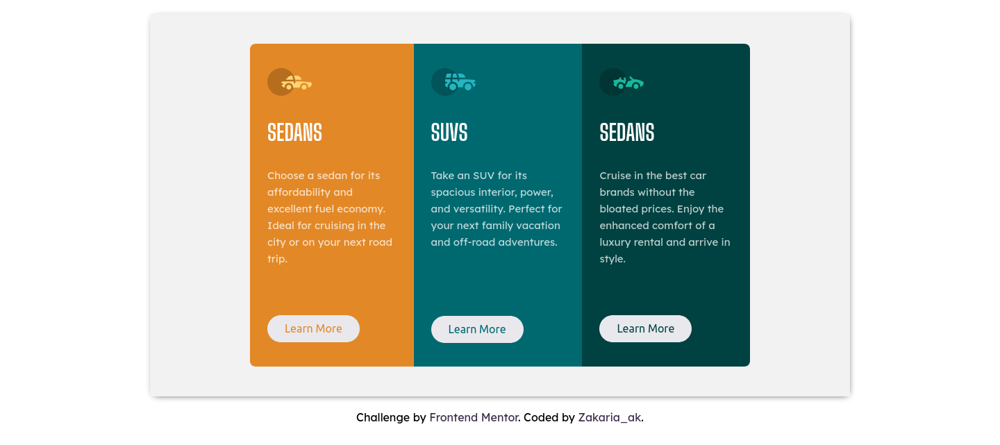
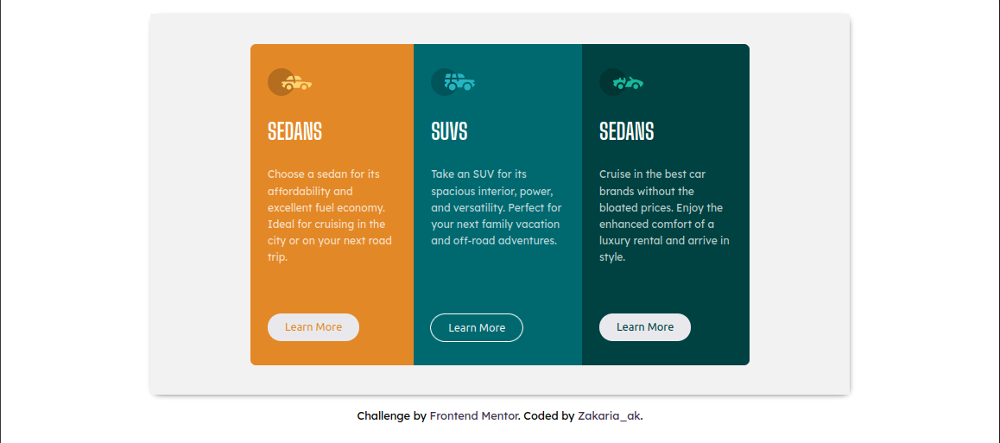

# Frontend Mentor - 3-column preview card component solution

This is a solution to the [3-column preview card component challenge on Frontend Mentor](https://www.frontendmentor.io/challenges/3column-preview-card-component-pH92eAR2-). 

## Table of contents

- [Overview](#overview)
  - [The challenge](#the-challenge)
  - [Screenshot](#screenshot)
  - [Links](#links)
- [My process](#my-process)
  - [Built with](#built-with)
  - [What I learned](#what-i-learned)
  - [Useful resources](#useful-resources)
- [Author](#author)

## Overview

### Screenshot

This one for the button Hover

### Links

- Solution URL: [Here](https://github.com/zakariae111/3-column-preview-card-component)
- Live Site URL: [Here](https://zakariae111.github.io/3-column-preview-card-component/)

## My process

### Built with

- Semantic HTML5 markup
- CSS custom properties
- Flexbox

### What I learned

Actualy i learn a lot from doing this project:
  -I got more information about resposive web : when and how to use max/min width , when to use absolute or relative units
  
  That's for this project 
  
  hope we will learn more by doing other projects
  the more **practice** you do the more **information** you got
  

### Useful resources

- [media Queries](https://www.w3schools.com/css/css_rwd_mediaqueries.asp) - This helped me in resposive design, i love the way they use grid view to change the components position according to the device width. I really liked this pattern and will use it going forward.

## Author

- Frontend Mentor - [@zakaria](https://www.frontendmentor.io/profile/zakariae111)

